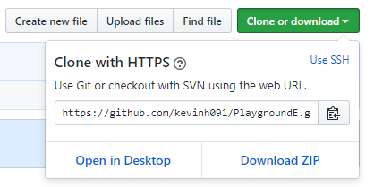
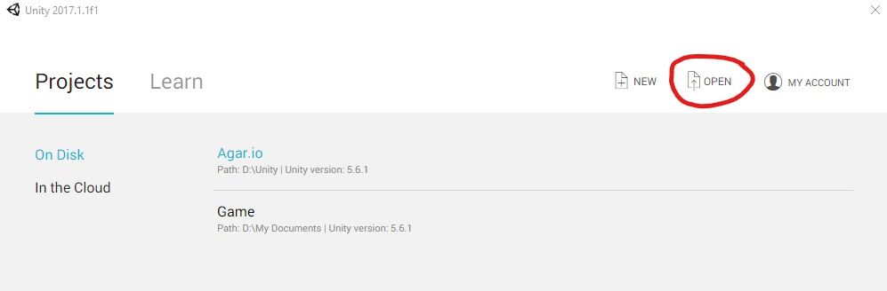
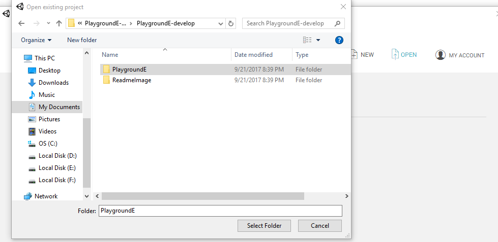
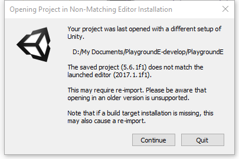
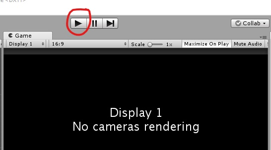
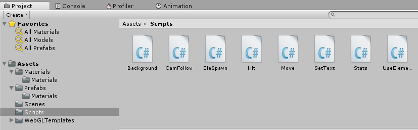

# PlaygroundE

PlaygroudE is a multi-player game that has a combat system and a control system like the game Magica. 
Players use combinations of elements to cast spell. However, players are put into an arena like PlayerUnknown’s BattleGround. 
The arena will get smaller over the game time. The last survivor will win. We will use Unity for game development.

## Installing

You will need **Unity** for game development. Download the latest version 
[here](https://store.unity.com/download?ref=personal "Unity Personal").

Note: This tutorial is only for **Windows** environment.

### Step 1:

Download files under the develop branch by clicking Download ZIP. Then unzip the file.

### Step 2:

Open Unity and sign in with a Unity account or skip that step. Then click "OPEN" in the Unity interface. 

Select the unzipped folder "PlaygroundE".

You may want to ignore the "non-matching editor" pop-up by clicking "Continue".

### Step 3:

To test this game, click the play icon at the top. 

You can also go to "Assets/Scripts" to edit game features.

